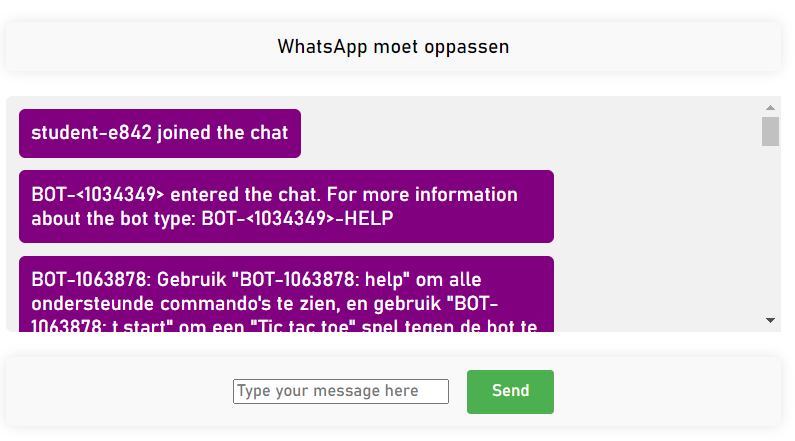

# TINNES-1 MQTT Chat App met ESP32 en centrale broker | Opdracht 2



Opdracht 2 voor `Netwerken en Security vervolg` is een MQTT chat app maken die onder andere sensor waardes kan opvragen bij een ESP32 bot.

Deze app maakt gebruikt van een centrale  MQTT broker en een webserver voor de front-end.


## Installatie

#### Installeer de recenste versie van docker voor jouw besturingsysteem hier.
https://docs.docker.com/get-docker/

#### Download de laatse versie van de applicatie als `.zip` van de GitHub repository
 https://github.com/ThomasvanEgmond/TINNES-1-Opdracht-2

Extraheer het `.zip` bestand naar een folder, hier noem ik hem `TINNES-1-Opdracht-2`.

#### Open een terminal in de folder `docker` aanwezig in de zojuist gemaakte folder, je terminal directory lijkt dus op het volgende.
```
PS C:\Users\tvane\Desktop\School\Jaar 2\Netwerk vervolg\TINNES-1-Opdracht-2\docker>
```
Controleer of `docker-compose.yaml` in je directory zit met het  `dir` commando.

#### In je terminal draai je het volgende commando

```
docker compose -f docker-compose.yaml up -d --build
```

Klaar! Je website is te bereiken via de URL [`localhost`](https://localhost).

## Applicatie gebruiken
### Inloggen bij de chat app
Voor deze opdracht is de chat app vooraf ingesteld op de centrale broker van [netwerkenbasis.com](https://netwerkenbasis.com/).

Benader de website via [localhost](https://localhost/).

inloggegevens voor de broker zijn als volgt:

```
Username: student
Password: welkom01
```


### ESP32 bot commando's
Chat commando's worden opgesteld als volgt.

Het bot ID `BOT-1038854` gevolgd met een `>` dit geeft aan dan je een commando wilt uitvoeren op deze bot, gevolgd door het commando bv. `temperatuur` en indien nodig een parameter, aangegeven met een aansluitende`:`.

```
BOT-1038854 > led:aan           # Zet de on-board LED van de ESP32 aan
BOT-1038854 > led:uit           # Zet de on-board LED van de ESP32 uit
BOT-1038854 > temperatuur       # Vraagt de temperatuur op, in graden Celcius
BOT-1038854 > druk              # Vraagt de temperatuur op, in Pascal
```